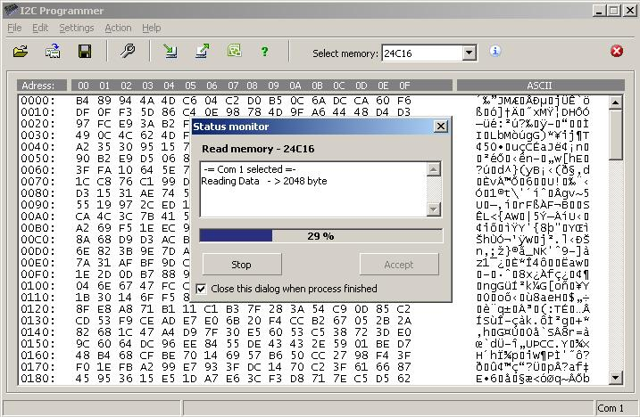



## Serial eeprom programmer

### Description

This is example how to program i2c serial eeproms. It include read, write, verify and blank check of memory. Supported types from 24c01 up to 24c512.

If you find this code useful please vote.
 
### More Info
 

             |
---                |---
**Submitted On**   |2009-08-24 16:48:30
**By**             |[Refik Zaimovic](https://github.com/Planet-Source-Code/PSCIndex/blob/master/ByAuthor/refik-zaimovic.md)
**Level**          |Beginner
**User Rating**    |4.6 (32 globes from 7 users)
**Compatibility**  |VB 6\.0
**Category**       |[Complete Applications](https://github.com/Planet-Source-Code/PSCIndex/blob/master/ByCategory/complete-applications__1-27.md)
**World**          |[Visual Basic](https://github.com/Planet-Source-Code/PSCIndex/blob/master/ByWorld/visual-basic.md)
**Archive File**   |[Serial\_eep2160838242009\.zip](https://github.com/Planet-Source-Code/refik-zaimovic-serial-eeprom-programmer__1-72391/archive/master.zip)

